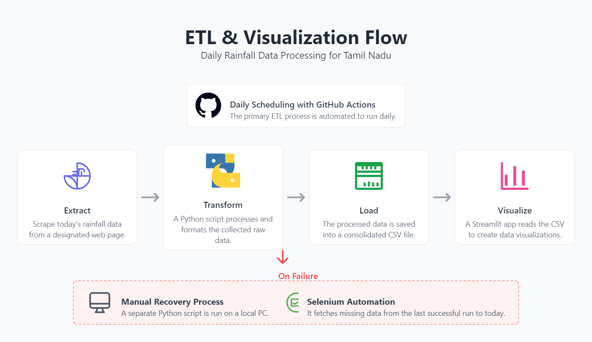
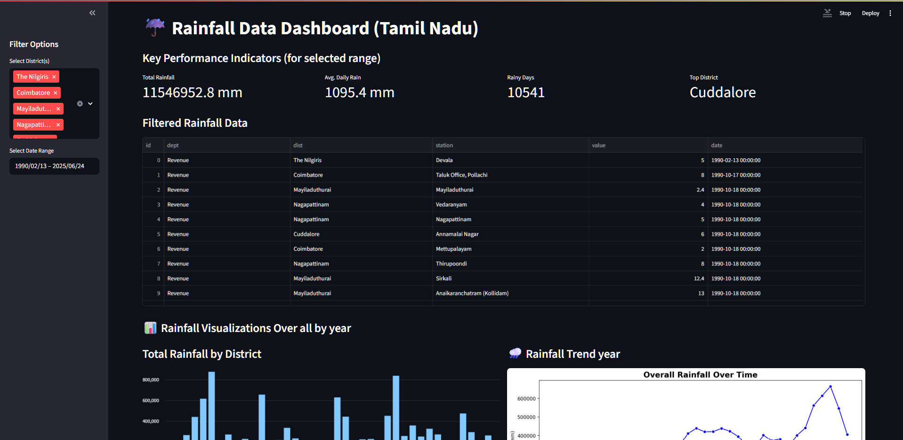

# Tamil Nadu Rainfall Data Automation & Analytics 2.0

A high-performance, ultra-premium climate telemetry pipeline and visual dashboard for monitoring rainfall data across Tamil Nadu. It automates web scraping from government sources, aggregates historical data, and provides a stunning, responsive, and instant-loading client-side Single Page Application (SPA) dashboard.

## 🚀 Key Features
*   **Daily Automated Scraper**: Uses headless Chrome automation to pull telemetry daily and merge it into a local CSV.
*   **V2.0 Static SPA Dashboard (`index.html`)**: A zero-latency, single-viewport dashboard featuring:
    *   **Live Met-Scan Cyber-Radar**: A canvas-based interactive radar sweep plotting district-wise precipitation warnings.
    *   **Station Mapping**: An interactive dark-mode Leaflet map plotting exact coordinates for hundreds of rain gauge stations.
    *   **7-Day Atmospheric Forecasts**: Live weather API integrations mapping maximum/minimum temperatures and rain rates with double-axis ApexCharts.
    *   **Lazy-Loaded History**: PapaParse dynamically parses the 39MB CSV database only when comparative tabs are active, keeping initial loading at 0ms.
    *   **Collapsible Sliding Drawer**: Seamless responsive layouts designed for mobile, tablet, and desktop screens.
*   **Streamlit Backend Visualizer (`app.py`)**: A Streamlit dashboard for native Python exploration and chart rendering.

---

## 📂 Project Structure
*   `index.html`: The core Single Page Web Application with custom scrollbars, glassmorphic HUD styling, and SPA tabs.
*   `main.py`: Automates daily observation scraping and dumps snapshots (`latest_rainfall.json` & `latest_rainfall.js`) for the web dashboard.
*   `getData.py`: Standard Selenium backfill script running in headless Chrome mode.
*   `error_get_data.py`: Recovery scraper to backfill any missing date ranges since `01-01-2025`.
*   `scraper_utils.py`: Refactored parsing helper containing common logic for scrapers.
*   `tnRainfallData.csv`: The local Git-diff-friendly database containing records from 1990 to present (39MB).
*   `raingauge_stations.csv`: Local geolocation coordinate mapping of weather stations.

---

## ⚙️ Setup and Installation

### 1. Clone the Repository
```bash
git clone https://github.com/arun8nov/TN_RainfallData_Automation-2.0.git
cd TN_RainfallData_Automation-2.0
```

### 2. Create and Activate Virtual Environment
**On Windows:**
```bash
python -m venv .venv
.\.venv\Scripts\activate
```
**On macOS/Linux:**
```bash
python3 -m venv .venv
source .venv/bin/activate
```

### 3. Install Dependencies
```bash
pip install -r requirements.txt
```

---

## 📈 Running the Pipeline

### Fetching Latest Rainfall Data
To execute the daily scrapers (runs headlessly, suitable for GitHub Actions):
```bash
python main.py
```
To backfill missing dates since 2025:
```bash
python error_get_data.py
```

### Visualizing Locally

**A. Live Web Dashboard (Recommended):**  
Since the app lazy-loads the 39MB CSV file, run a quick local HTTP server to bypass browser CORS file restrictions:
```bash
python -m http.server 8000
```
Then open `http://localhost:8000/index.html` in your browser.

**B. Live Streamlit App:**
```bash
streamlit run app.py
```

---

## 🌐 Deploying to Hosting Services (Free)

### Option A: Deploy on Vercel (Static Dashboard)
1. Link your GitHub repository `TN_RainfallData_Automation-2.0` to your Vercel account.
2. Select **Import** project.
3. Keep default settings (Framework Preset: **Other**, Root: `./`).
4. Click **Deploy**. Vercel will host your static SPA dashboard instantly with a custom URL.

### Option B: Deploy on GitHub Pages (Static Dashboard)
1. Go to your repository settings page on GitHub.
2. Click **Pages** in the sidebar.
3. Set **Build and deployment > Branch** to `main` (under `/root`) and click **Save**.
4. Within 1 minute, your site will be live at `https://arun8nov.github.io/TN_RainfallData_Automation-2.0/`.

---

## ETL Diagram


## 🖼️ Streamlit Dashboard Screenshot


### Live Streamlit Link: https://arun8nov-tn-rainfalldata-automation-app-zbsxu0.streamlit.app/

---
Author: **Arunprakash B**
